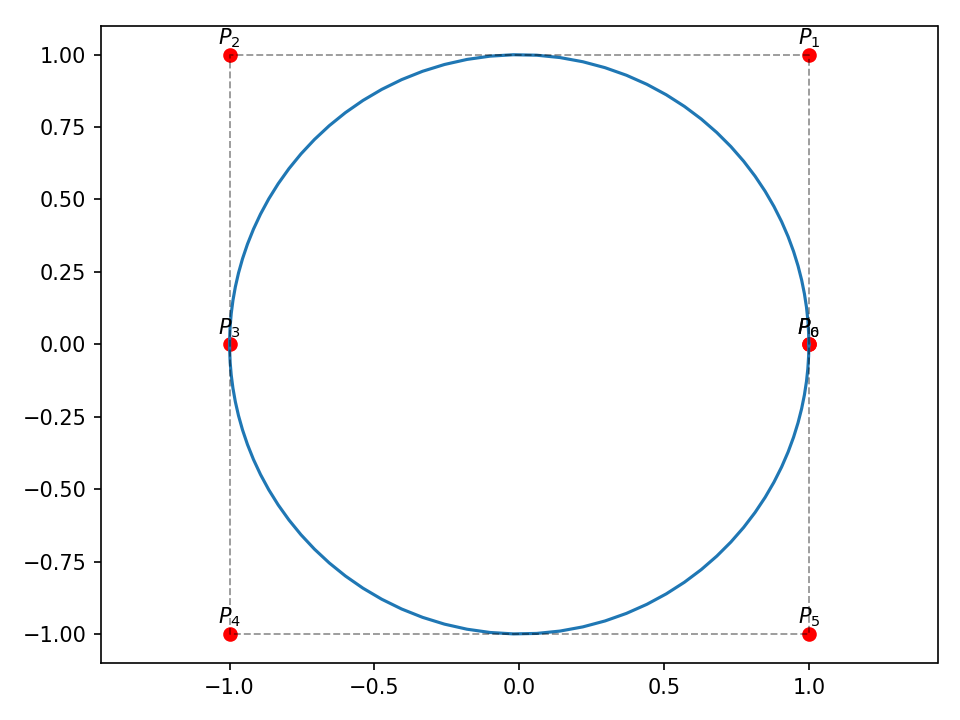
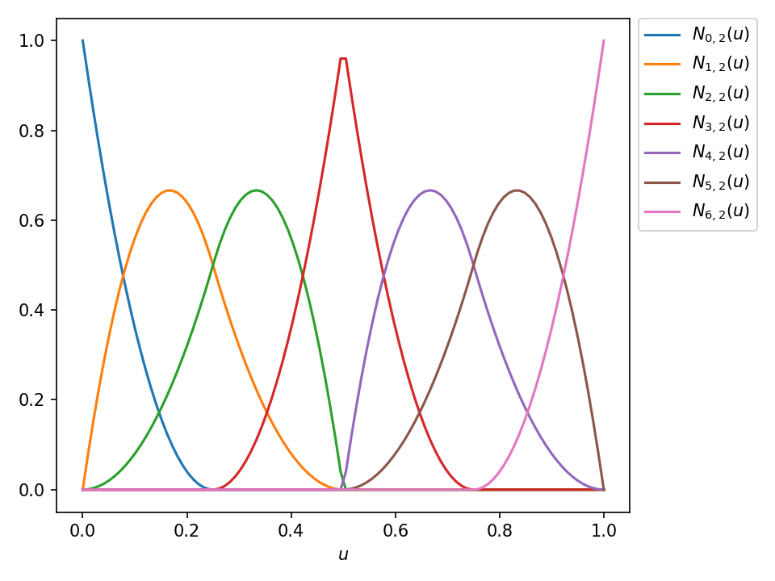

# DGAC2020 - Curvas NURBS

Este repositorio contiene el material de la presentación del tema de curvas NURBS, una implementación de B-Spline y NURBS en Python. La presentación también se encuentra disponible en [rpubs](https://rpubs.com/luis_castillo/631816).

## Requerimientos

`Python 3.7.X`

`Numpy`

`Matplotlib`

`Mayavi`

`PythonOCC 7.4`

## Ejemplo de uso

    import numpy as np
    from bspline import Nurbs
    
    # curve parameters
    degree = 2
    points = np.array([[0, 0], [0, 1], [1, 0], [2, 1], [2, 0]])
    weights = np.array([1, 1, 0.5, 1, 1]),
    knots = np.array([0, 0, 0, 1, 2, 3, 3, 3])
    
    # parametric variable
    u = np.linspace(u_list[0], u_list[-1], 100)
    
    # compute the NURBS curve
    spline = Nurbs(degree, points, knots, weights, u)

Con el atributo `spline.curve` se pude acceder a los puntos de 2D o 3D de la curva para graficarla 
con `matplotlib` o `mayavi`, para graficar esta curva con `PythonOCC` se facilita el modulo `occ_utils`.

La clase `Nurbs` tambien te permite acceder las funciones base que componen 
la curva por medio del atributo `spline.basis_funcs`.

