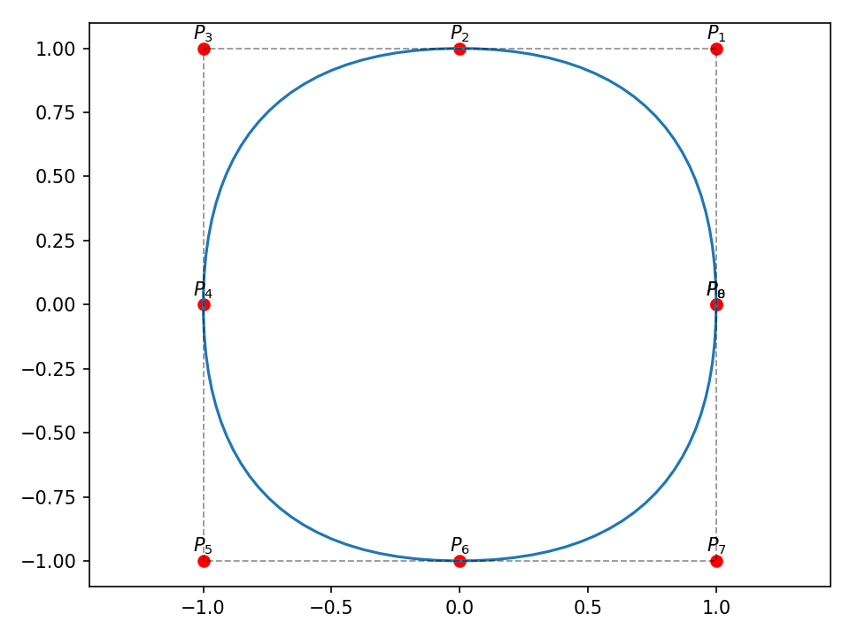

\renewcommand{\figurename}{Figura}
```{r setup, include=FALSE}
knitr::opts_chunk$set(echo = TRUE)
```

# 1. Introducción

**NURBS** son las siglas de **N**o-**U**niforme **R**ational **B-S**pline, son la representación más popular de una *spline* en los software comerciales de CAD. Son capaces de representar una gran variadas de formas como círculos, hipérbolas, parábolas y aun así preservar exactitud matemática.

* **No-Uniforme**: La propiedad de *no-uniformidad* se refiere al uso de un vector editable conocido como nodos (*knots*) que permite el uso de características no uniformes por partes.

* **Racional**: La propiedad de *racionalidad* le da más flexibilidad a la *spline*, pero también incrementa su complejidad. Esta propiedad también introduce un vector editable conocido como pesos (*weights*) que modifican el aporte de los puntos de control a la curva.

* **B-Spline**: La curva tiene una función *base* de B-Spline, que asegura una mezcla suave de la influencia de los puntos de control sobre la curva.

# 2. B-Splines

Una B-Spline regular esta definida por los siguientes parámetros:

* Un grado $p$, este parámetro define el grado de cada segmento de curva.

* Un conjunto de puntos de control $\mathbf{P}_i$ con $i=0,..,n-1$.

* Un vector de nodos o *knots* $\mathbf{U}=\{u_0,...,u_m\}$, que es una secuencia no decreciente de valores, donde $m=n+p+1$.

El vector de nodos es un conjunto no decreciente de valores $u_j \leq u_{j+1}$ donde $j=0,1,...,m$ y $m=n+p+1$. Algunos autores \citep{piegl1995nurbs, jankauskas2010} utilizan una forma *normalizada* de este vector, tal que el espacio paramétrico $u \in [a,b]$ de la B-Spline $\mathbf{C}(u)$ y los valores del vector de nodos $\mathbf{U}=\{u_j\}$ están acotados en el intervalo $[0,1]$. También, es común el uso del vector de nodos sujeto (*clamped knot vector*), donde los primeros $p+1$ son iguales al valor $a$ y los últimos $p+1$ valores son iguales a $b$. En su forma *normalizada* $a=0$ y $b=1$, por lo tanto los primeros $p+1$ son iguales a $0$ y los últimos $p+1$ valores son iguales a $1$. Esto es:

$$
\mathbf{U} = \{ u_0=...=u_p=0 \leq u_{p+1} \leq ... \leq u_{n-1} \leq u_n = ... =u_{n+p+1} = 1 \}
$$

## 2.1. Definición
Cada punto de la curva sobre la variable paramétrica $u$ se encuentra definido por la siguiente expresión\citep{piegl1995nurbs}:

$$
\tag{1}
\mathbf{C}(u) = \sum_{i=0}^{i<n} N_{i,p}(u) \mathbf{P}_{i}
$$
Donde $p$ es el grado de la función base, $\mathbf{P}_{i}$ son los $n$ puntos de control.

## 2.2. Funciones base
Las funciones base de una B-Spline está definida por la siguiente expresión\citep{jankauskas2010}:

$$
\tag{2}
N_{i, 0}(u)=\left\{\begin{array}{cc}
1 & \text { si } u_{i} \leq u<u_{i+1} \\
0 & \text { si no }
\end{array}\right.
$$

$$
N_{i, p}(u)=\frac{u-u_{i}}{u_{i+p}-u_{i}} N_{i, p-1}(u)+\frac{u_{i+p+1}-u}{u_{i+p+1}-u_{i+1}} N_{i+1, p-1}(u)
\tag{3}
$$

Donde $u$ es la coordenada de la variable paramétrica y $u_j$ son los valores del vector de nodos (*knots*) $\mathbf{U}$.

### 2.2.1. Observaciones

* La expresión (3) es conocida como la fórmula recursiva de *Cox-de Boor*\citep{jankauskas2010}

* Para $p>0$, la función base $N_{i,p}$ está expresada en términos de dos funciones de grado $p-1$

* El intervalo $[u_i,u_{i+1})$ se conoce el espacio generado por el $i$-enésimo nodo (*$i$th knot span*)

* Si existen nodos repetidos (esto pasa a menudo), entonces podrían ocurrir divisiones sobre cero, el resultado de estas operaciones es considerado $0$\citep{jankauskas2010, piegl1995nurbs}

* Relacionado con lo anterior, si un nodo se repite en el vector de nodos. El número de veces que se repite este valor es llamado multiplicidad del nodo (*multiplicity of the knot*)


### 2.2.2. Propiedades:
A continuación se enlistan algunas de las propiedades de las funciones base de las B-Splines\citep{hss2013}:

* **Positividad**: $N_{i,p}(u)>0, u \in (u_i,u_{i+p+1})$

* **Soporte local**: $N_{i,p}(u)=0, u \not\in (u_i,u_{i+p+1})$

* **Polinomio por partes**: $N_{i,p}(u)$ son funciones polinomiales por partes de grado $p$

* **Partición unitaria**: $\sum_{i=0}^{i<n} N_{i,p}(u) = 1$ para todo $u\in[a,b]$

* **Continuidad**: Si el nodo interior $u_i$ tiene multiplicidad $k_i$, entonces $N_{i,p}$ tiene continuidad $C^{p-k_i}$ en  $u=u_i$ y $C^{\infty}$ en cualquier otra parte

## Ejemplo 2.1 {#ex_2_1}
Con $p=2$, $\mathbf{U}=\{0,0,0,1,2,3,3,4,4,4\}$ y los puntos de control $\mathbf{P}_i = \{(0,1),(1,1),(3,4),(4,2),(5,3),(6,4),(7,3)\}$ y grado $p=2$.

{width=65%}

{width=65%}

En la figura \ref{ex_01_01} se muestran las funciones base de grado $p=2$ y en la figura \ref{ex_01_02} la curva B-Spline correspondiente a los puntos de control.

## 2.3. B-Splines No-Uniformes
El término *uniformidad* es usado para definir la relación entre la secuencia de puntos de control y el espacio paramétrico de la *spline*. La influencia del punto de control sobre la curva está definido por las funciones base y los dominios de la función están divididos por los nodos. Esto significa que la propiedad de uniformidad está embebida en el vector de nodos. Consideremos el caso del vector de nodos en su forma sujeta y uniforme \citep{jankauskas2010}:

$$
\mathbf{U}=\left\{u_{0}=\ldots=u_{p}=0 \ldots u_{i}=\frac{i-p}{n-p} \ldots u_{n}=\ldots=u_{n+p+1}=1\right\}
$$

Donde $p+1 \leq 1 < n$. Esta secuencia de nodos divide todo el espacio paramétrico $u$ en intervalos uniformes. Cada intervalo contiene $p+1$ funciones base $N_{i,p}>0$, entonces la curva es afectada por $p+1$ puntos de control en este intervalo. En el caso genera los nodos pueden estar distribuidos de forma no uniforme. Sin embargo la secuencia debe ser no-decreciente.

## Ejemplo 2.2 {#ex_2_2}
Es un hecho que no es posible representar secciones cónicas con B-Splines no regulares. Pongamos esto en práctica tratando de generar un círculo con una B-Spline de grado $p=2$, el vector de nodos $\mathbf{U}=\{0, 0, 0, 0.5, 0.5, 1, 1, 1.5, 1.5, 2, 2, 2\}$ y los puntos de control:

$$
\mathbf{P} = \begin{bmatrix}
  1 & 1 & 0 & -1 & -1 & -1 & 0 & 1 & 1 \\
  0 & 1 & 1 & 1 & 0 & -1 & -1 & -1 & 0
\end{bmatrix}^{T}
$$

{width=80%}

{width=80%}

La figura \ref{ex_02_01} muestra las funciones base de grado $p=2$ y la figura \ref{ex_02_02} muestra la curva B-Spline correspondiente a los puntos de control.


# 3. B-Splines Racionales No-Uniformes (NURBS)

## 3.1. Definición
Una curva NURBS de grado $p$ está definida por la siguiente expresión\citep{salomon2007curves}:

$$
\tag{4}
\mathbf{C}(u) = \frac{\sum_{i=0}^{i<n}w_i N_{i,p}(u) \mathbf{P}_i}{\sum_{i=0}^{i<n}w_i N_{i,p}(u)}
$$

Donde $\mathbf{P}_i$ son los puntos de control (que forman el polígono de control), los $w_i$ son los pesos (*weights*)  y $N_{i,p}$ es la función de base de B-Spline de grado $p$ definida sobre un vector de nodos no periódico y no uniforme

La curva también se puede expresar como:

$$
\tag{5}
\mathbf{C}(u) = \sum_{i=0}^{i<n} R_{i,p}(u) \mathbf{P}_i
$$

Donde:
$$
\tag{6}
R_{i,p}(u) = \frac{w_i N_{i,p}(u)}{\sum_{i=0}^{i<n} w_i N_{i,p}(u)}
$$


Otra forma muy usada de expresar una curva NURBS es utilizando la misma expresión de una B-Spline genérica (1). Dado un punto de control  $\mathbf{P}_i=(x_i,y_i,z_i)$ y definiendo los *puntos de control homogéneos* $\mathbf{P}_i^w$ como:

$$
\tag{7}
\left\{\begin{array}{ll}
\mathbf{P}_{i}^{w}=\left(w_{i} x, w_{i} y, w_{i} z, w_{i}\right), & \text { cuando } w_{i} \neq 0 \\
\mathbf{P}_{i}^{w}=(x, y, z, 0), & \text { cuando } w_{i}=0
\end{array}\right.
$$

Entonces una curva NURBS en *coordenadas homogéneas* está definida por la siguiente expresión\citep{piegl1995nurbs}´:
$$
\tag{8}
\mathbf{C}^{w}(u) = \sum_{i=0}^{i<n} N_{i,p}(u) \mathbf{P}_i^w
$$

Para obtener la proyección el espacio tridimensional $\mathbf{C}(u)$ a partir de $\mathbf{C}^w(u)$ debemos aplicar el siguiente mapeo de perspectiva denotado por $H$:

$$
\tag{9}
\mathbf{P}=H\left\{\mathbf{P}^{w}\right\}=H\{(x, y, z, w)\}=\left\{\begin{array}{ll}
\left(\frac{x}{w}, \frac{y}{w}, \frac{z}{w}\right) & \text { si } w \neq 0 \\
(x, y, z) & \text { si } w=0
\end{array}\right.
$$

Aplicando este mapeo de perspectiva, $H$, en $\mathbf{C}^w(u)$ produce la curva racional B-Spline correspondiente:

$$
\tag{10}
\mathbf{C}(u)=H\left\{\mathbf{C}^{w}(u)\right\}=H\left\{\sum_{i=0}^{n} N_{i, p}(u) \mathbf{P}_{i}^{w}\right\}
$$

**Nota**: Estrictamente hablando, la curva en coordenadas homogéneas $\mathbf{C}^w(u)$ no es una curva racional.

## Ejemplo 3.1 {#ex_3_1}
Antes de continuar vamos a ilustrar el efecto de los pesos $w_i$ con un ejemplo. Se construyeron diferentes curvas con los mismos puntos de control $\mathbf{P}_i$ y vector de nodos $\mathbf{U}$ pero se cambió uno de los pesos $\{1,1,w_2,1,1\}$, la variación del parámetro $w_2$ y su efecto en la construcción de las curvas se puede ver en la figura \ref{ex_03}.

{width=60%}

## 3.2. Propiedades
La funciones bases $R_{i,p}(u)$ son funciones racionales por partes sobre la variable paramétrica $u \in [a,b]$.

Estas tienen las siguientes propiedades, derivadas de la expresión (6) y otras heredadas de las propiedades de $N_{i,p}(u)$:

1. **No negatividad**: $R_{i,p}(u) \geq 0$ para todo $i,p$ y $u\in[a,b]$

2. **Partición de la unidad**: $\sum_{i=0}^{i<n} R_{i,p}(u) = 1$ para todo $u\in[a,b]$

3. \* $R_{0,p}(u) = R_{n,p}(u)=1$

4. Para $p>0$, toda $R_{i,p}(u)$ alcanzan exactamente un máximo en el intervalo $u \in [a,b]$

5. \* **Soporte local**: $R_{i,p}(u)=0$ para $u \not\in [u_i,u_{i+p+1})$. Además, para todo espacio generado por el vector de nodos interior (*interior knot span*)  $\text{span}\{u_{p+1},...,u_{n-1}\}$, al menos $p+1$ de las $R_{i,p}(u)$ es diferente de cero, generalmente $R_{i-p,p}(u),...,R_{i,p}(u)$  son diferentes de cero en el intervalo $[u_i,u_{i+1})$

6. \* Todas las derivadas de $R_{i,p}(u)$ existen en el $\text{span}\{u_{p+1},...,u_{n-1}\}$ donde es una función racional con denominador distinto de cero. Sobre un nodo con multiplicidad $k$, $R_{i,p}(u)$ es $p-k$ veces continuamente diferenciable

7. Si $w_i=1$ para todo $i$, entonces $R_{i,p}(u) = N_{i,p}(u)$ para todo $i$, esto quiere decir que las funciones $N_{i,p}(u)$ son un caso especial de $R_{i,p}(u)$. De hecho, para cualquier $c \not= 0$, si $w_i=c$ para todo $i$ entonces $R_{i,p}(u) = N_{i,p}(u)$ para todo $i$

8. \* $\mathbf{C}(a)=\mathbf{P}_0$  y $\mathbf{C}(b)=\mathbf{P}_n$. Esto es una consecuencia de la propiedad 3

9. **Invariancia afín**: Las curvas NURBS son invariantes proyecciones de perspectiva

10. **Envoltura convexa (*fuerte*)** (*strong convex hull property*): Si $u \in [u_i, u_{i+1})$, entonces $\mathbf{C}(u)$ vive dentro del casco convexo formado por los puntos de control $\mathbf{P}_{i-p},...,\mathbf{P}_i$

11. \* $\mathbf{C}(u)$ es infinitamente diferenciable en el $\text{span}\{u_{p+1},...,u_{n-1}\}$ y es $p-k$ veces diferenciable sobre un nodo con multiplicidad $k$. Esto es una consecuencia de la propiedad 6

12. **Variación decreciente**: Ninguna línea (o plano) tiene más intersecciones con la curva que con el polígono de control

13. \* Una curva sin nodos interiores es una curva de Bézier racional, dado que $N_{i,p}(u)$ se reduce al polinomio de Bernstein $B_{i,n}(u)$. Esto, junto con la propiedad 7, implica que las curvas NURBS contienen a las curvas B-Spline y Bézier, racionales y no racionales como casos especiales

14. **Aproximación local**: Si el punto de control $\mathbf{P}_i$ es movido, o el peso $w_i$ es cambiado, esto afecta únicamente al segmento de curva sobre el intervalo de $u \in [u_i, u_{i+p+1})$

**Nota**: Los enunciados con (\*) son ciertos considerandos que el vector de nodos $\mathbf{U}=\{u_j\}$ está en su forma sujeta (*knot clamped vector*).

## 3.3. Derivadas
Se pueden utilizar las mismas formulas y algoritmos para calcular las derivadas de una curva B-Spline no racional. Estas formarlas aplican para $\mathbf{C}^w(u)$, dado que es una curva no racional en cuatro dimensiones. Entonces podemos expresar las derivadas de $\mathbf{C}(u)$ en términos de las derivadas de $\mathbf{C}^w(u)$:

$$
\tag{11}
\mathbf{C}(u)=\frac{w(u) \mathbf{C}(u)}{w(u)}=\frac{\mathbf{A}(u)}{w(u)}
$$

Donde $\mathbf{A}(u)$ es una función vectorial que contiene las primeras tres coordenadas de $\mathbf{C}^w(u)$.

Aplicando reglas de cálculo fundamental sobre (11) podemos expresar:

$$
\begin{aligned}
\mathbf{C}^{\prime}(u) &=\frac{w(u) \mathbf{A}^{\prime}(u)-w^{\prime}(u) \mathbf{A}(u)}{w(u)^{2}} \\
&=\frac{w(u) \mathbf{A}^{\prime}(u)-w^{\prime}(u) w(u) \mathbf{C}(u)}{w(u)^{2}}=\frac{\mathbf{A}^{\prime}(u)-w^{\prime}(u) \mathbf{C}(u)}{w(u)}
\end{aligned}\tag{12}
$$

Dado que $\mathbf{A}(u)$ y $w(u)$ representan las coordenadas de $\mathbf{C}^w(u)$, podemos obtener sus primeras derivadas utilizando la formula recursiva de la $k$-ésima derivada de una B-Spline, expresiones (13-14):

$$
\tag{13}
\mathbf{C}^{(k)}(u)=\sum_{i=0}^{n-k} N_{i, p-k}(u) \mathbf{P}_{i}^{(k)}
$$

Donde:

$$
\tag{14}
\mathbf{P}_{i}^{(k)}=\left\{\begin{array}{ll}
\mathbf{P}_{i} & k=0 \\
\frac{p-k+1}{u_{i+p+1}-u_{i+k}}\left(\mathbf{P}_{i+1}^{(k-1)}-\mathbf{P}_{i}^{(k-1)}\right) & k>0
\end{array}\right.
$$

Siguiendo este procedimiento podemos evaluar la primer derivada $\mathbf{A}(u)$ y $w(u)$  en la coordenada $u=0$ y obtenemos:

$$
\mathbf{A}^{\prime}(0)=\frac{p}{u_{p+1}}\left(w_{1} \mathbf{P}_{1}-w_{0} \mathbf{P}_{0}\right) \quad w^{\prime}(0)=\frac{p}{u_{p+1}}\left(w_{1}-w_{0}\right)
$$

Ahora sustituimos estos resultados en la expresión (12) para obtener la primer derivada de $\mathbf{C}(u)$ en $u=0$:

$$
\begin{aligned}
\mathbf{C}^{\prime}(0)&=\frac{\frac{p}{u_{p+1}}\left(w_{1} \mathbf{P}_{1}-w_{0} \mathbf{P}_{0}\right)-\frac{p}{u_{p+1}}\left(w_{1}-w_{0}\right) \mathbf{P}_{0}}{w_{0}} \\\\
&=\frac{p}{u_{p+1}} \frac{w_{1}}{w_{0}}\left(\mathbf{P}_{1}-\mathbf{P}_{0}\right)
\end{aligned}
$$

Y para calcular las derivadas de orden mayor podemos utilizar la siguiente expresión:

$$
\tag{15}
\mathbf{C}^{(k)}(u)=\frac{\mathbf{A}^{(k)}(u)-\sum_{i=1}^{k}\left(\begin{array}{c}
k \\
i
\end{array}\right) w^{(i)}(u) \mathbf{C}^{(k-i)}(u)}{w(u)}
$$

## Ejemplo 3.2 {#ex_3_2}
Representar secciones cónicas es posible utilizando curvas NURBS (en general con curvas racionales), retomando el fallido intento del círculo del [ejemplo 2.2](#ex_2_2) de las curvas B-Splines, consideremos ahora una curva NURBS de grado $p=2$, con el vector de nodos $\mathbf{U}=\{0, 0, 0, 0.25, 0.5, 0.5, 0.75, 1, 1, 1\}$, los pesos ^$\mathbf{w}=\{1,5,5,1,5,5,1\}$ y los puntos de control:

$$
\mathbf{P} = \begin{bmatrix} 1 & 1 & -1 & -1 & -1 & 1 & 1 \\ 0 & 1 & 1 & 0 & -1 & -1 & 0\end{bmatrix}^T \\
$$

{width=80%}

{width=80%}

## 3.4. Elevación de grado
Sea $\mathbf{C}_n(u)=\sum_{i=0}^{n} = \mathbf{a}_i u^i$ una curva polinomial de grado $n$. Podemos asignar $\mathbf{a}_{n+1}=0$ y expresar $\mathbf{C}_n(u)$ como una curva polinomial de grado $n+1$:

$$
\mathbf{C}_{n}(u)=\mathbf{C}_{n+1}(u)=\sum_{i=0}^{n+1} \mathbf{a}_{i} u^{i}
$$

Lo que estamos haciendo es simplemente expresar $\mathbf{C}_n(u)$ como un subespacio de $\mathbf{C}_{n+1}(u)$.

Ahora, recordemos la expresión de una curva NURBS de grado $p$ en coordenadas homogéneas de la expresión (8):

$$
\mathbf{C}^w(u)=\sum_{i=0}^{n} N_{i,p}(u) \mathbf{P}_i^w
$$

Dado que $\mathbf{C}^w(u)$ es una curva polinomial por partes, es posible elevar su grado a $p+1$. Esto quiere decir que existen un conjunto de puntos de control $\mathbf{Q}_i^w$ y un vector de nodos $\mathbf{\hat{U}}$ tal que:

$$
\tag{16}
\mathbf{C}_{p}^{w}(u)=\mathbf{C}_{p+1}^{w}(u)=\sum_{i=0}^{\hat{n}} N_{i, p+1}(u) \mathbf{Q}_{i}^{w}
$$

$\mathbf{C}_{p+1}^w(u)$ y $\mathbf{C}_p^w(u)$ son la misma curva, tanto geométricamente como paramétricamente.  $\mathbf{C}_{p+1}^w(u)$ es simplemente $\mathbf{C}_p^w(u)$ embebida en un espacio dimensional de orden mayor.

El problema de elevación de grado se refiere al proceso de encontrar los puntos de control $\mathbf{Q}_i^w$ y el vector de nodos $\mathbf{\hat{U}}$.

## 3.5. Reducción de grado
Definamos una B-Spline (racional o no racional) de grado $p$:

$$
\mathbf{C}(u) = \sum_{i=0}^n N_{i,p}(u) \mathbf{Q}_i
$$

Sobre un vector de nodos:

$$
\mathbf{U}=\{\underbrace{a, \ldots, a}_{p+1}, \underbrace{u_{1}, \ldots, u_{1}}_{m_{1}}, \ldots, \underbrace{u_{s}, \ldots, u_{s}}_{m_{s}}, \underbrace{b, \ldots, b}_{p+1}\}
$$

$\mathbf{C}(u)$ se dice ser *reducible de grado* si tiene una representación precisa de la forma:

$$
\tag{17}
\mathbf{C}(u)=\hat{\mathbf{C}}(u)=\sum_{i=0}^{\hat{n}} N_{i, p-1}(u) \mathbf{P}_{i}
$$

Sobre un vector de nodos:

$$
\tag{18}
\mathbf{\hat{U}}=\{\underbrace{a, \ldots, a}_{p}, \underbrace{u_{1}, \ldots, u_{1}}_{m_{1}-1}, \ldots, \underbrace{u_{s}, \ldots, u_{s}}_{m_{s}-1}, \underbrace{b, \ldots, b}_{p}\}
$$

Donde $\hat{n}=n-s-1$.

# Referencias